# Tapsi_Project

This project is implementing the UI of tapsi website. The project is responsive in different device sizes. Demo on [Vercel](https://tapsi-project.vercel.app/).

## Technologies

- HTML5
- CSS3
- JavaScript

## Screenshots

- **Desktop size**

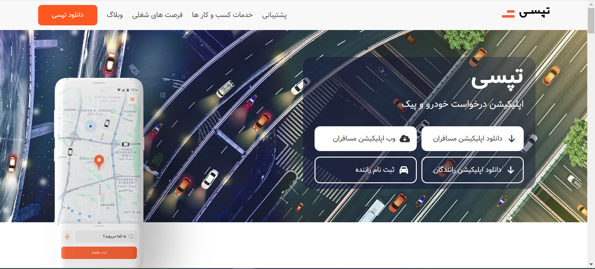

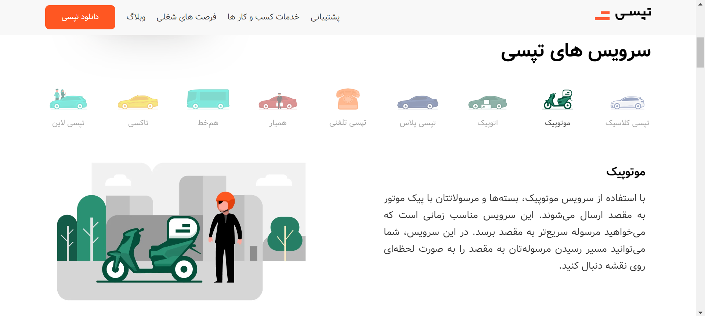

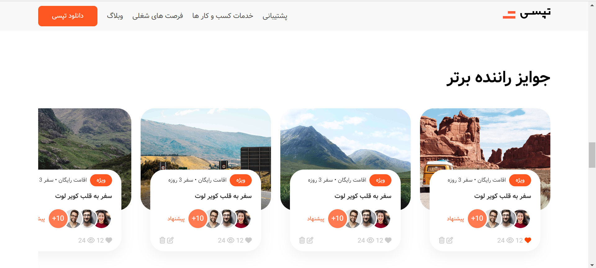

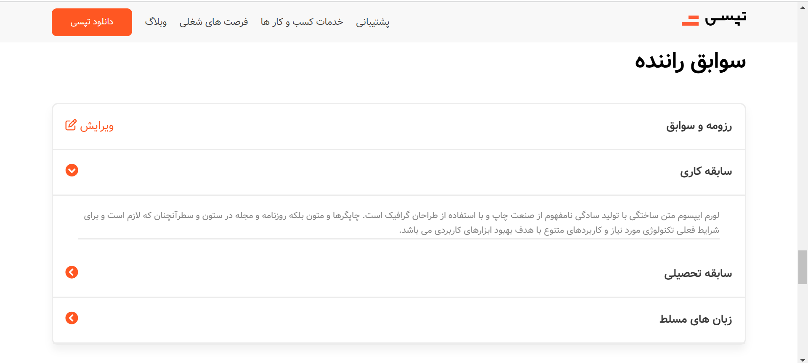

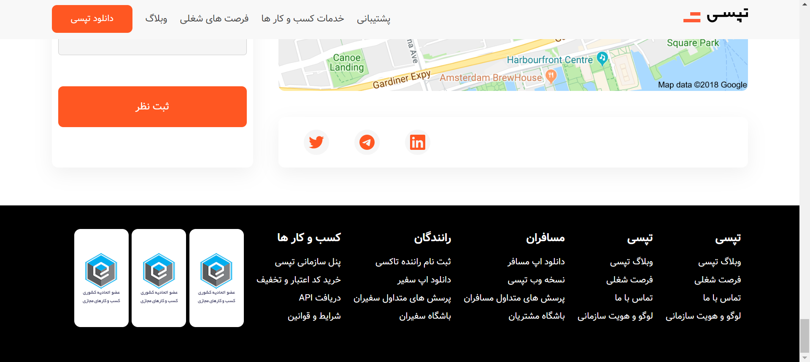

- **Tablet size**

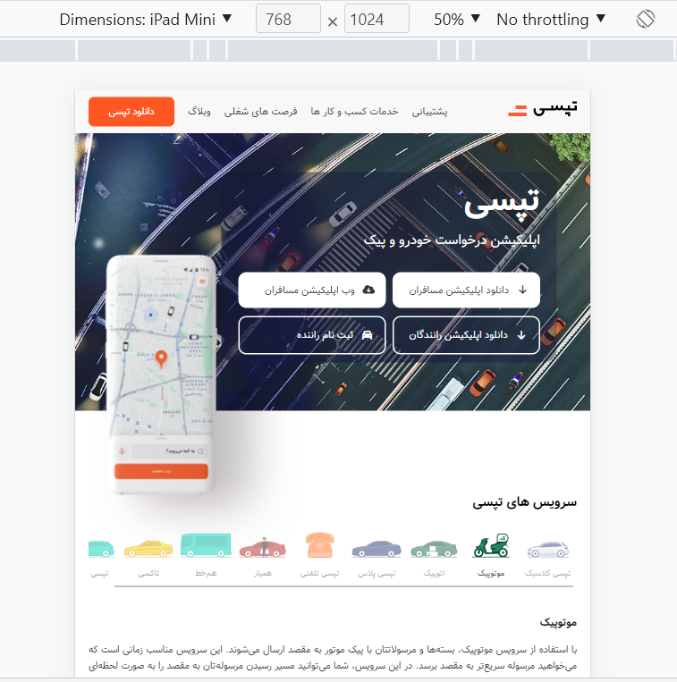

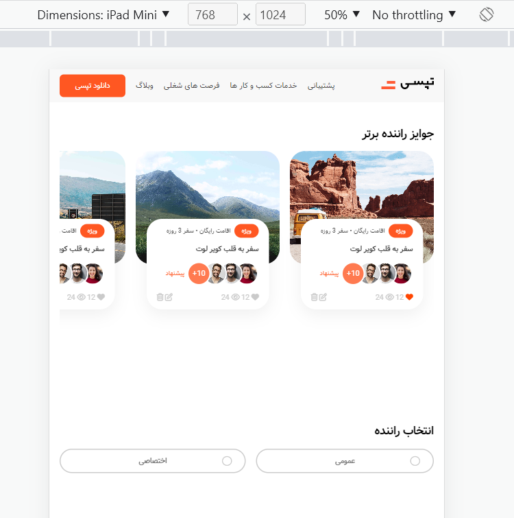

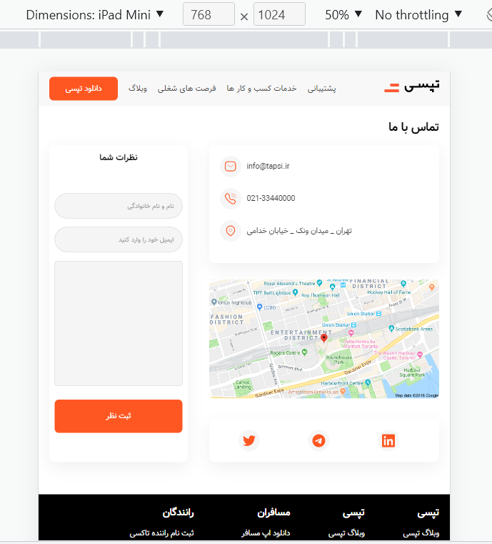

- Mobile size

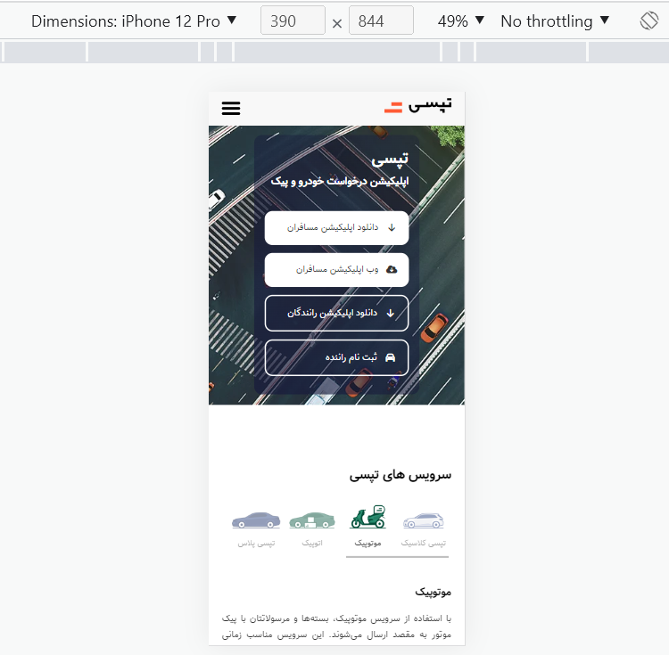

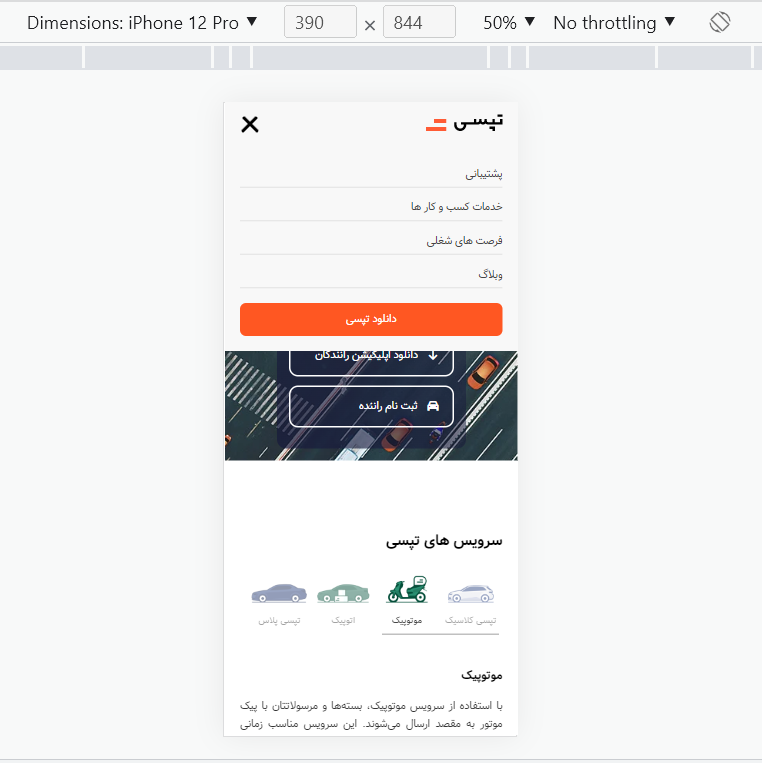

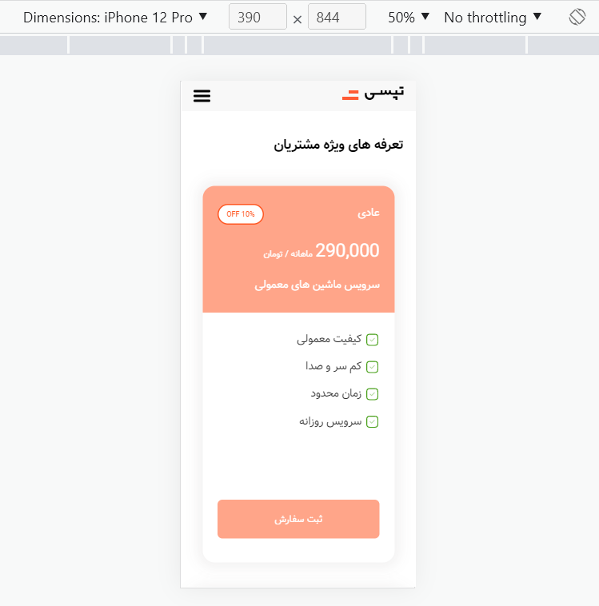

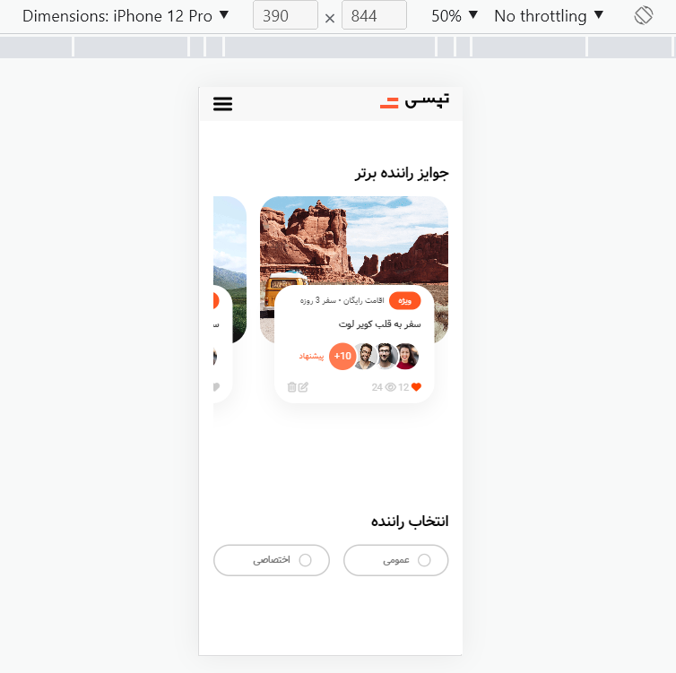

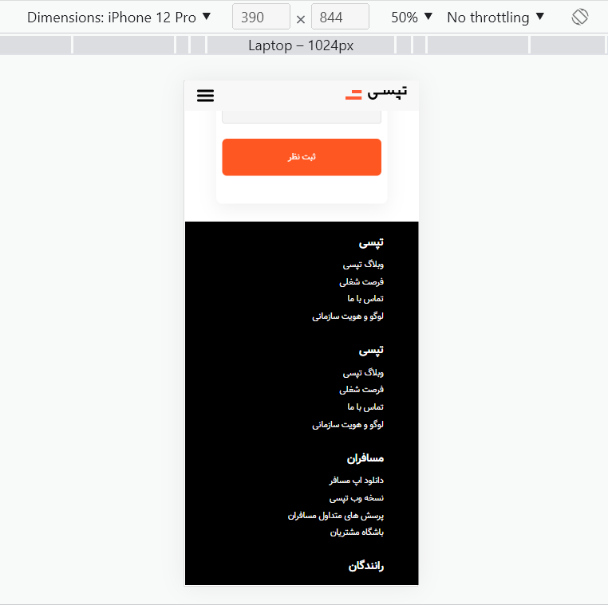